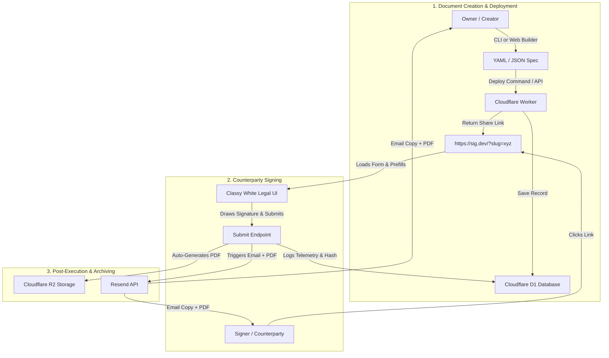

# 🏛️ LegalForm 2.0: Product Architecture & System Specification

> **Mission Statement:** A frictionless, developer-first, open-source alternative to DocuSign. Deploy a legally binding document (NDA, SAFE, Contract, Waiver) in under **30 seconds** via CLI or Web UI, collect cryptographically audited signatures, and receive auto-rendered PDFs instantly.

---

## 🎯 Target Audience & Product Philosophy

* **Target Users:** Founders, engineers, legal counsel, and power-users who find DocuSign/HelloSign slow, expensive, and bloated.
* **Core Philosophy:** 
  - **Zero Bloat:** Declarative document creation (YAML / Web Form builder).
  - **100% Free / Self-Hostable:** Built on Cloudflare Workers, D1, R2, and Pages (zero monthly subscription fees).
  - **Court-Grade Legal Enforcement:** Native compliance under **US ESIGN Act (15 U.S.C. § 7001)** and **EU eIDAS Regulation (No 910/2014, Art. 25 AdES)**.

---

## 🔒 Strict Scope Definition (What We Build vs. What We Omit)

### IN SCOPE (Must-Have Core):
1. **Instant Slug Generation:** Simple 1-command deployment (`legalform deploy contract.yaml`).
2. **Dynamic Pre-Filling:** URLs can pre-fill any variable (`/?slug=xyz&disclosing_party=Acme&receiving_party=BetaCorp`).
3. **Automatic Date/Time Locking:** Execution timestamps are automatically captured in UTC from edge NTP servers.
4. **Dual Email Notification with PDF Attachment:** Resend API sends signed PDF directly to both Signer and Owner upon completion.
5. **Interactive Web Admin Dashboard:** View active/closed documents, view live signers, revoke links, and download PDFs in 1 click.
6. **Automatic PDF Generation on Edge/Worker:** Cloudflare Worker generates & stores signed PDF directly in R2.
7. **Tamper-Evident SHA-256 Audit Trail:** IP hash, device fingerprint, NTP timestamp, and field-level focus telemetry.

### OUT OF SCOPE (Strictly Excluded):
- ❌ Multi-party sequential signing workflow loops (Keep it 1-to-1 or 1-to-many template broadcast).
- ❌ Complex drag-and-drop coordinate mapping (Use clean structured document sections).
- ❌ Third-party OAuth / Identity verification services (Use magic email OTP verification).
- ❌ Paid billing / paywalls.

---

## 👤 User Flow Journeys



---

## 🛠️ Complete System Architecture & Technology Stack

```
+-----------------------------------------------------------------------+
|                           FRONTEND (Pages)                            |
|  - Classy White Legal Typography (Cinzel & Newsreader Fonts)           |
|  - Mobile Signature Canvas Pad (iOS/Android Touch Support)            |
|  - Real-Time UTC Timestamp & Client Telemetry Recorder                |
+-----------------------------------------------------------------------+
                                   |
                                   v
+-----------------------------------------------------------------------+
|                           BACKEND (Worker)                            |
|  - Hono Routing Engine                                                |
|  - Edge PDF Rendering (PDFKit / PDF-Lib)                             |
|  - Cryptographic Audit Engine (SHA-256 Chain)                         |
|  - Resend Mail Integration (Dual Party Delivery)                      |
+-----------------------------------------------------------------------+
                  /                                    \
                 v                                      v
+-------------------------------+      +--------------------------------+
|       DATABASE (D1)           |      |        VAULT (R2)              |
|  - Documents & Slugs          |      |  - Signed PDF Documents        |
|  - Rate Limits & Tokens       |      |  - JSON Telemetry Bundles       |
|  - Submissions & Audit Logs   |      +--------------------------------+
+-------------------------------+
```

---

## 📑 Feature Requirements & API Endpoints

### 1. Document Management (`/api/documents`)
- `POST /api/documents` -> Create/Deploy new document spec.
- `GET /api/documents/list` -> List all active and closed documents with stats.
- `POST /api/doc/:slug/close` -> Immediately revoke signing link.

### 2. Signing & Verification (`/api/submit/:slug`)
- `GET /api/doc/:slug` -> Fetch spec, validate expiry, log `page_open` audit event.
- `POST /api/submit/:slug` -> Process signature, compute SHA-256 hash, render PDF, save to R2, send dual emails.

### 3. PDF Certificate Engine
- Auto-generates formal PDF document containing full agreement clauses, filled fields, embedded signature graphic, and SHA-256 audit digest.

---

## 🚀 Future Roadmap & Execution Phases

- [x] Phase 1: Core Worker API, D1 Schema, and Basic HTML UI.
- [x] Phase 2: Classy White Legal UI Redesign, R2 Storage, Resend Email.
- [x] Phase 3: eIDAS & ESIGN Act Compliance, UTC Timestamp Auto-Lock.
- [ ] **Phase 4 (Next):** Edge PDF Generation directly inside Cloudflare Worker (eliminates need for local python PDF command).
- [ ] **Phase 5 (Next):** Integrated Web Admin Dashboard in Pages (`/admin`).
