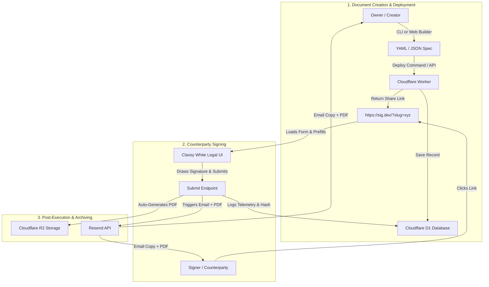

# 🏛️ LegalForm 2.0: Product Architecture & System Specification

> **Mission Statement:** A frictionless, developer-first, open-source alternative to DocuSign. Deploy a legally binding document (NDA, SAFE, Contract, Waiver) in under **30 seconds** via CLI or Web UI, collect cryptographically audited signatures, and receive auto-rendered PDFs instantly.

---

## 🎯 Target Audience & Product Philosophy

* **Target Users:** Founders, engineers, legal counsel, and power-users who find DocuSign/HelloSign slow, expensive, and bloated.
* **Core Philosophy:** 
  - **Zero Bloat:** Declarative document creation (YAML / Web Form builder).
  - **100% Free / Self-Hostable:** Built on Cloudflare Workers, D1, R2, and Pages (zero monthly subscription fees).
  - **Court-Grade Legal Enforcement:** Native compliance under **US ESIGN Act (15 U.S.C. § 7001)** and **EU eIDAS Regulation (No 910/2014, Art. 25 AdES)**.

---

## 🔒 Strict Scope Definition (What We Build vs. What We Omit)

### IN SCOPE (Must-Have Core):
1. **Instant Slug Generation:** Simple 1-command deployment (`legalform deploy contract.yaml`).
2. **Dynamic Pre-Filling:** URLs can pre-fill any variable (`/?slug=xyz&disclosing_party=Acme&receiving_party=BetaCorp`).
3. **Automatic Date/Time Locking:** Execution timestamps are automatically captured in UTC from edge NTP servers.
4. **Dual Email Notification with PDF Attachment:** Resend API sends signed PDF directly to both Signer and Owner upon completion.
5. **Interactive Web Admin Dashboard:** View active/closed documents, view live signers, revoke links, and download PDFs in 1 click.
6. **Automatic PDF Generation on Edge/Worker:** Cloudflare Worker generates & stores signed PDF directly in R2.
7. **Tamper-Evident SHA-256 Audit Trail:** IP hash, device fingerprint, NTP timestamp, and field-level focus telemetry.

### OUT OF SCOPE (Strictly Excluded):
- ❌ Multi-party sequential signing workflow loops (Keep it 1-to-1 or 1-to-many template broadcast).
- ❌ Complex drag-and-drop coordinate mapping (Use clean structured document sections).
- ❌ Third-party OAuth / Identity verification services (Use magic email OTP verification).
- ❌ Paid billing / paywalls.

---

## 👤 User Flow Journeys



---

## 🛠️ Complete System Architecture & Technology Stack

```
+-----------------------------------------------------------------------+
|                           FRONTEND (Pages)                            |
|  - Classy White Legal Typography (Cinzel & Newsreader Fonts)           |
|  - Mobile Signature Canvas Pad (iOS/Android Touch Support)            |
|  - Real-Time UTC Timestamp & Client Telemetry Recorder                |
|  - Integrated Admin Dashboard UI (/admin)                             |
+-----------------------------------------------------------------------+
                                   |
                                   v
+-----------------------------------------------------------------------+
|                           BACKEND (Worker)                            |
|  - Hono Routing Engine                                                |
|  - Edge PDF Generator (pdf-lib)                                       |
|  - Cryptographic Audit Engine (SHA-256 Chain)                         |
|  - Resend Mail Integration with Base64 PDF Attachments                |
+-----------------------------------------------------------------------+
                  /                                    \
                 v                                      v
+-------------------------------+      +--------------------------------+
|       DATABASE (D1)           |      |        VAULT (R2)              |
|  - Documents & Slugs          |      |  - Signed PDF Documents (.pdf) |
|  - Rate Limits & Tokens       |      |  - JSON Telemetry Bundles       |
|  - Submissions & Audit Logs   |      +--------------------------------+
+-------------------------------+
```

---

## 📋 Comprehensive Feature Gap Analysis & To-Do List

Below is the exhaustive breakdown of **Current Implementation State vs. Target Requirements** based on real-world user flows and legal requirements:

### 1. Document Creation & Deployment Flow
- [x] Declare legal documents via YAML specifications (`document`, `sections`, `form`, `signature`).
- [x] CLI command (`deploy`) to publish document specs to Cloudflare Worker + D1.
- [x] Dynamic field pre-filling via CLI flags (`-f key=value`) and URL query parameters (`?key=value`).
- [x] Flexible Admin Email configuration (`--admin-email` flag, `LEGALFORM_ADMIN_EMAIL` env var, or YAML spec).
- [ ] **[TODO] Edge PDF Generator inside Worker (`pdf-lib`):** Generate the complete executed PDF directly inside the Cloudflare Worker upon submission instead of requiring local Python execution.
- [ ] **[TODO] Web Document Builder Interface (`/builder`):** Visual WYSIWYG editor on Cloudflare Pages to build, preview, and deploy YAML/JSON document specs without touching the CLI.

---

### 2. Signer Experience & Court Enforcement Flow
- [x] Mobile-optimized, responsive signature pad with touch-action handling (`touch-action: none`).
- [x] Classy white legal document typography using *Cinzel* & *Newsreader* Google Fonts.
- [x] Statutory compliance footer for **US ESIGN Act (15 U.S.C. § 7001)** & **EU eIDAS Regulation (No 910/2014, Art. 25 AdES)**.
- [x] Non-editable `datetime-auto` execution timestamp field locked to UTC.
- [x] Field interaction telemetry recorder (focus, blur, value hashing, IP hashing, browser fingerprinting).
- [ ] **[TODO] Interactive Form Validation Feedback:** Real-time inline field validation indicators for missing required fields before signature canvas touch.
- [ ] **[TODO] Direct PDF Download Button on Thank You Screen:** Allow the counterparty to download their executed PDF contract immediately upon hitting "Submit" directly in their browser.

---

### 3. Execution, Email & Archiving Flow
- [x] Save JSON submission records & audit trails to Cloudflare D1 database.
- [x] Save JSON submission bundles to Cloudflare R2 bucket (`legalform-docs`).
- [x] Resend email dispatch to both Signer (`signer_email`) and Admin (`admin_notification_email`).
- [ ] **[TODO] Direct PDF Attachment in Resend Email:** Attach the actual auto-rendered `.pdf` file to the Resend confirmation emails so both parties get an instantly readable PDF in their inbox without opening JSON files.
- [ ] **[TODO] R2 Storage Direct PDF Upload (`submissions/<doc_id>/<sub_id>.pdf`):** Save both `.json` (audit logs) and `.pdf` (formatted contract) to R2 storage for 1-click downloads.

---

### 4. Admin Management & Dashboard Flow
- [x] Backend API endpoint `GET /api/documents/list` to fetch deployed document slugs and statuses.
- [x] Backend API endpoint `POST /api/doc/:slug/close` to force-close active signing links.
- [x] CLI commands (`list`, `close`, `export`, `pdf`).
- [ ] **[TODO] Cloudflare Pages Web Admin Dashboard (`/admin`):**
  - Protected by `ADMIN_API_KEY` authentication.
  - Table of all deployed documents, status toggles (Active / Closed), and submission counts.
  - 1-Click "Download Executed PDF" button next to each submission.
  - 1-Click "Revoke Slug" toggle.

---

## 📑 Feature Requirements & API Endpoints

### 1. Document Management (`/api/documents`)
- `POST /api/documents` -> Create/Deploy new document spec.
- `GET /api/documents/list` -> List all active and closed documents with stats.
- `POST /api/doc/:slug/close` -> Immediately revoke signing link.

### 2. Signing & Verification (`/api/submit/:slug`)
- `GET /api/doc/:slug` -> Fetch spec, validate expiry, log `page_open` audit event.
- `POST /api/submit/:slug` -> Process signature, compute SHA-256 hash, render PDF via `pdf-lib`, save `.pdf` + `.json` to R2, send dual emails with PDF attachment.

---

## 🚀 Execution Roadmap & Task Priority

- [x] **Phase 1 (Completed):** Core Worker API, D1 Schema, Hono Router, Basic UI.
- [x] **Phase 2 (Completed):** Classy White Legal UI Redesign, R2 Storage, Resend Email.
- [x] **Phase 3 (Completed):** eIDAS & ESIGN Act Compliance, UTC Timestamp Auto-Lock, CLI Commands (`list`, `close`, `export`, `pdf`).
- [ ] **Phase 4 (In Progress):** Worker Edge PDF Generation (`pdf-lib`) & Resend Email PDF Attachments.
- [ ] **Phase 5 (Upcoming):** Cloudflare Pages Admin Dashboard (`/admin`).
